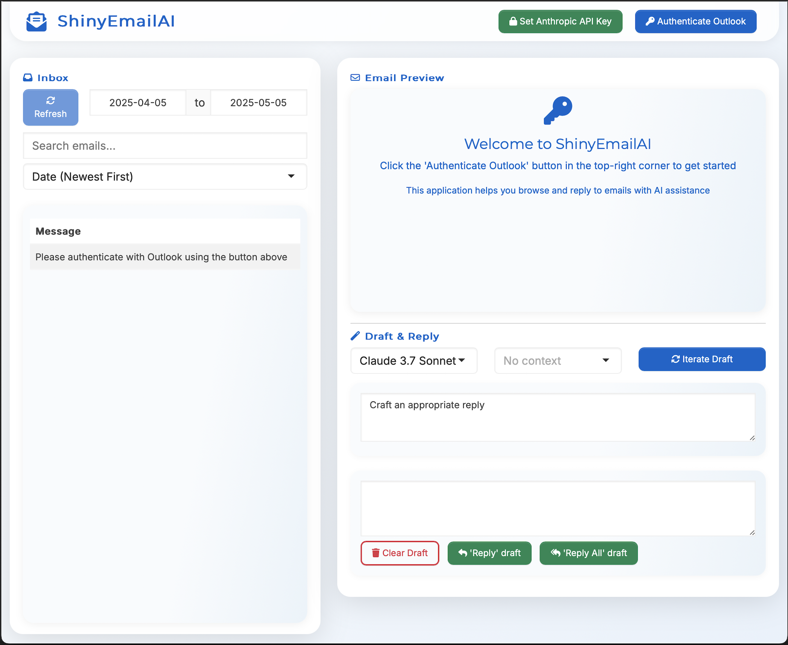

**ShinyEmailAI** is an R package that integrates Microsoft Outlook 365 with AI-assisted email drafting. It provides an interactive Shiny application that allows users to:

- Browse, search, and sort Outlook emails
- View complete email content with HTML formatting and attachments
- Draft and refine email responses using AI models (primarily Anthropic's Claude)
- Add context to AI responses through custom context folders
- Create Outlook "Reply" and "Reply All" drafts directly from the application

## Installation

```r
# Install remotes if you don't have it
if (!requireNamespace("remotes", quietly = TRUE)) {
  install.packages("remotes")
}

# Install ShinyEmailAI from GitHub
remotes::install_github("christian-engels/ShinyEmailAI")
```

## Getting Started

```r
# Load the package
library(ShinyEmailAI)

# Create context and prompts structure in a custom directory
email_create_context("~/ShinyEmailAI_Data")

# Run the application
email_run_app("~/ShinyEmailAI_Data")
```

## Features

- **Easy Authentication**: Connect to your Microsoft Outlook 365 account with through the official Microsoft365R authentication mechanism
- **Advanced Email Browsing**: Search, filter, and sort emails with a responsive interface
- **AI-Assisted Drafting**: Generate and refine email responses with Claude AI models
- **Context-Aware Responses**: Add domain-specific context to improve AI responses
- **Direct Integration**: Create Outlook draft emails with a single click
- **Customizable**: Use your own prompt templates and context materials

## Context Folders

The application supports using context files (as PDFs) to enhance AI responses. An example folder structure is:

```
context/
  context-folder-1/
    document1.pdf
    document2.pdf
  context-folder-1/
    document3.pdf
  no-context/
    do-not-change-this-folder.md
```

## Customizing Prompts

You can customize how the AI generates responses by modifying the prompt templates in the `prompts/` directory:

- `prompt-system.md`: The main system prompt that defines the AI's behavior
- `prompt-iterate-on-draft.md`: The prompt used when refining drafts
- `email-samples.md`: Example emails to help the AI understand your style

## Run from Command Line

```bash
# Add this shell function to ~/.zshrc or ~/.bash_profile
emails() {
  # create context dir if missing
  if [ ! -d ~/ShinyEmailAI_Data ]; then
    R -e "library(ShinyEmailAI); email_create_context('~/ShinyEmailAI_Data')"
  fi
  # run the Shiny app
  R -e "library(ShinyEmailAI); email_run_app('~/ShinyEmailAI_Data')"
}

# Reload your shell:
source ~/.zshrc  # or ~/.bash_profile

# Launch the app:
emails
```

## API Requirements

You'll need:

- Microsoft 365 account with Outlook access
- Anthropic API key for Claude models

## License

MIT License